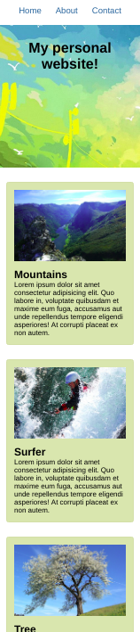

# Sassy Website

Create a mockup website as seen in the [reference image folder](./images_reference).

**Instructions**:

* To run this project, use `npm run start`
* The starter code is in the `src` folder. Work in the existing files.
* Write your styles using sass. 
* Make use of nesting and variables where possible.
* Make sure to design for mobile first!

* Using Flexbox change how elements are displayed on the page depending on the screen size.
* Elements with class `.card` should use the `$secondary-color` variable as the background color.
* Elements with class `.card` should use the `$border-size` and `$secondary-color` variables for the border.
* `aside` should have its border property defined using the `$border-size` and `$secondary-color` variables.

* Breakpoints:
    - 768px - tablet (the width of `.card` should be 80%)
    - 1024px - desktop (`.cards` container should center its childeren using justify-content)

* Colors for styling: 
    - Card background color: #e0ddb2
    - Card and aside border color: #e0ddb2
    - Color used for nav and footer: #0e749e
* Use the images in the [images folder](./src/images) for the header and cards.

